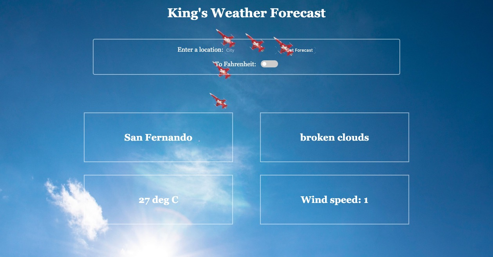

# Weather-App-JS

The aim of this project was to design and build a weather forecasting site using ES modules, webpack and the OpenWeather API [The Odin Project](https://www.theodinproject.com/courses/javascript/lessons/weather-app).

<p align="center">
  
</p>

### Live Link

To see the live version of the page, click [here](https://rawcdn.githack.com/KerronKing/Weather-App-JS/cc8049feb723d2478674c1c7444bb7642de725a7/dist/index.html).

### How to Use

* Open the terminal and clone the repo 
```
git clone https://github.com/KerronKing/Weather-App-JS
```
* Enter a valid city and country (correct spelling necessary) in the search areas provided.
* Use the toggle box to toggle between viewing temperature in degress celcius & fahrenheit.

### Built With
* HTML
* CSS
* JavaScript

## Contributing

Contributions, issues and feature requests are welcome!

## Future Improvements

* Expanded details
* Country name implementation for narrowing search

## Show your support

Feel free to drop a :+1: to show your support. It'd be greatly appreciated it :pray:

## Author

:bust_in_silhouette: Kerron King

* Github: [@KerronKing](https://github.com/KerronKing)

* Twitter: [@KerronTriniDev](https://twitter.com/kerrontrinidev)

* Linkedin: [Kerron King](linkedin.com/in/kerron-shawn-king)
